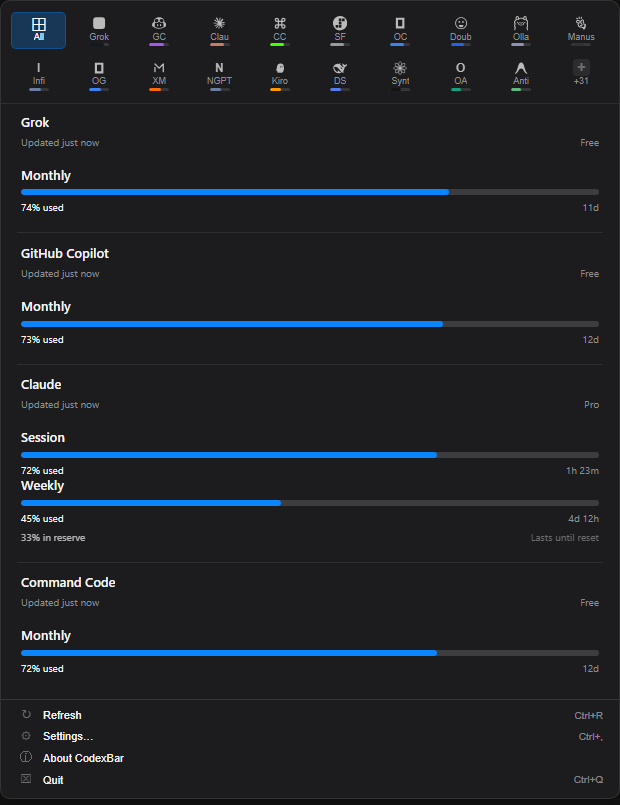
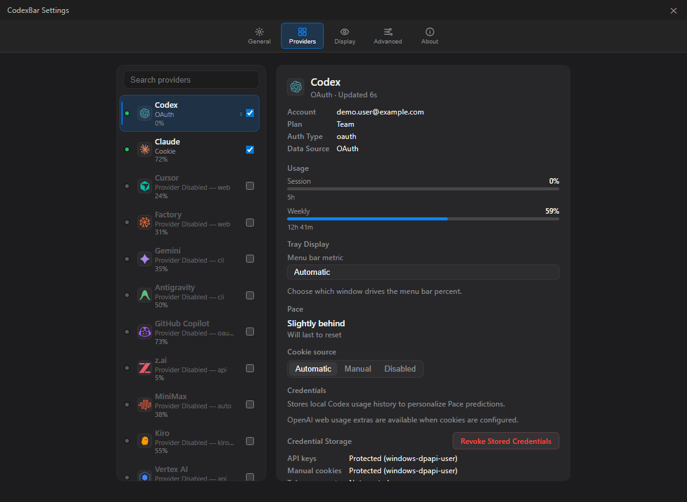

# TokenBar

[English](./README.md) | [简体中文](./README.zh-CN.md) | [繁體中文（臺灣）](./README.zh-TW.md) | [日本語](./README.ja-JP.md) | [한국어](./README.ko-KR.md) | [Español mexicano](./README.es-MX.md)

TokenBar 是一个 Windows 系统托盘应用，用来集中查看 AI 编程工具的使用量，减少在多个服务商面板之间切换。它将 [CodexBar](https://github.com/steipete/CodexBar) 的用量工作流带到 Tauri + React 桌面壳，并使用 Rust 共享服务商逻辑。

<p align="center">
  
  
</p>

## 功能

- 托盘面板显示紧凑的服务商额度卡片，并支持刷新。
- 服务商设置支持凭据、会话 Cookie、API 密钥、地区和显示选项（以服务商能力为准）。
- 自动读取浏览器会话与手动导入 Cookie 是两种独立来源，不创建应用自有登录浏览器。
- 提供本地 CLI，用于查询用量、成本、配置和诊断。
- 提供 Windows 安装版与便携版，并发布 SHA-256 校验文件（如该版本包含）。
- 支持中文、英文、繁体中文、日语、韩语和墨西哥西班牙语界面。

## 安装

请从 [TokenBar Releases](https://github.com/shawnqd/TokenBar/releases) 下载最新 Windows 安装包或便携版。每个版本的可执行文件和校验文件以发布页为准。

目前 TokenBar 通过 GitHub Releases 分发，尚未启用 Winget。

## 首次运行

1. 从开始菜单或便携版可执行文件启动 TokenBar。
2. 点击托盘图标打开用量面板。
3. 打开 **设置 → 服务商**，启用需要使用的服务商。
4. 按服务商支持的方式配置来源：自动读取浏览器、已保存/手动 Cookie、API 密钥或服务商 CLI/OAuth。未支持的方式不会显示。

## 从源码构建

要求：Windows 10/11、Node.js（含 pnpm）和 Rust 工具链。

```powershell
git clone https://github.com/shawnqd/TokenBar.git
cd TokenBar
pnpm --dir apps/desktop-tauri install
pnpm --dir apps/desktop-tauri tauri:dev
```

构建生产版本：

```powershell
pnpm --dir apps/desktop-tauri tauri:build
```

更多构建命令见 [docs/BUILDING.md](docs/BUILDING.md)。

## 隐私

- 服务商数据来自本地配置或用户配置的服务商 API。
- 仅对已启用的服务商执行浏览器 Cookie 读取，诊断信息不包含 Cookie 原文。
- API 密钥、手动 Cookie 和账号数据使用 Windows 可用的受保护凭据存储。
- 诊断只包含服务商、来源和状态元数据，不包含凭据。

## 文档

- [从源码构建](docs/BUILDING.md)
- [浏览器 Cookie](docs/COOKIES.md)
- [WSL 说明](docs/WSL.md)

## macOS

TokenBar 维护 Windows 版本。macOS 用户请直接使用原版 CodexBar：
[steipete/CodexBar](https://github.com/steipete/CodexBar)。

## 许可证

TokenBar 使用 MIT 许可证。项目参考了 [CodexBar](https://github.com/steipete/CodexBar) 和 [ccusage](https://github.com/ryoppippi/ccusage)。
